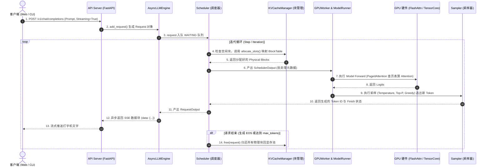

# 第 12 周技术报告：vLLM 核心源码拆解与请求全生命周期链路

- **周次阶段**：Week 12（第三阶段：vLLM 与推理服务·收官里程碑）
- **核心目标**：深度拆解 vLLM 官方源码架构，打通“一个请求从用户 API 敲下回车，到 GPU 吐出 Token”的端到端数据流与控制流。
- **参考源码**：vLLM 工业级核心模块（`vllm.engine`、`vllm.v1.core.sched`、`vllm.v1.core.kv_cache_manager`、`vllm.v1.worker`）

---

## 一、 vLLM 端到端全景架构与数据流图

---

## 二、 7 大核心模块深度拆解（大厂必考考点）

按照计划书要求的标准，我们对 vLLM 最关键的 7 个模块逐一回答：**输入是什么？输出是什么？解决了什么性能与工程问题？**

---

### 1. API Server & Engine (`vllm.entrypoints.openai.api_server` & `vllm.engine.async_llm_engine`)

* **源码位置**：`vllm/entrypoints/openai/api_server.py`、`vllm/engine/async_llm_engine.py`
* **输入 (Input)**：
  HTTP POST 请求体（JSON 格式，包含 Prompt、模型名称、`stream` 开关、`temperature`、`max_tokens` 等参数）。
* **输出 (Output)**：
  异步迭代器（`AsyncGenerator`），持续产出 SSE（Server-Sent Events）事件流 `data: {"choices": [{"delta": {"content": "字"}}]}...`。
* **解决的系统与性能问题**：
  1. **异步非阻塞接入**：将高并发的外部网络 I/O 与底层的同步 GPU 计算解耦。Web 线程只负责接收请求并放入队列，后台推理引擎按照自己的最大吞吐节奏（Step）批量拉取。
  2. **流式并发打字机**：利用 Python `asyncio` 事件循环，实现每个 Token 生成后毫秒级推送到客户端，将首字延迟（TTFT）的用户感知降到极致。

---

### 2. 调度器 (`vllm.v1.core.sched.scheduler.Scheduler`)

* **源码位置**：`vllm/v1/core/sched/scheduler.py`
* **核心方法**：`schedule(self) -> SchedulerOutput`
* **输入 (Input)**：
  当前等待队列中的新请求、正在运行的请求列表、以及从 KVCacheManager 拿到的可用物理块剩余情况。
* **输出 (Output)**：
  **`SchedulerOutput`**，告诉底层的 GPU Worker：本轮迭代（Step）要跑哪几个请求的 Prefill、哪几个请求的 Decode，以及新分配的页表映射。
* **解决的系统与性能问题（核心灵魂）**：
  1. **打破静态批处理的气泡（Continuous Batching）**：传统的批处理必须等 Batch 中最长的那句话说完了所有人才能走。Scheduler 实现了**迭代级动态插拔**：短请求第 10 步说完立刻退出释放显存；新请求在第 11 步立刻插入进来做 Prefill。
  2. **显存超额防爆仓与抢占（Preemption）**：当 Decode 阶段显存块不足时，Scheduler 会优雅地选择优先级最低的请求，将其物理块暂时**驱逐（Eviction / Swap）**到 CPU 内存或丢弃重新排队，优先保全高优先级请求正常吐字，绝不引发整个服务崩溃（OOM）。

---

### 3. KV Cache 分页管理器 (`vllm.v1.core.kv_cache_manager.KVCacheManager`)

* **源码位置**：`vllm/v1/core/kv_cache_manager.py`、`vllm/v1/core/block_pool.py`
* **核心方法**：`allocate_slots()`、`free()`、`get_block_ids()`
* **输入 (Input)**：
  请求的唯一 ID、需要分配或追加的 Token 槽位数。
* **输出 (Output)**：
  已分配的物理显存块 ID 列表（`List[int]`）或更新后的 BlockTable 映射。
* **解决的系统与性能问题**：
  1. **彻底消除 60%~80% 的显存碎片浪费（PagedAttention）**：正是我们在第 11 周手写的核心逻辑！将 KV 缓存按 16 tokens 切分成小块，物理显存离散存放，按需步进申请。
  2. **前缀缓存（Prefix Caching）**：通过哈希计算 Prompt 的 Token 序列，自动识别重复的前缀（如大型系统提示词、少样本示例 Few-Shot），让多个并发请求共享同一组物理显存块（只读），带来零显存消耗的二次加速。

---

### 4. GPU 工作进程 (`vllm.v1.worker.gpu_worker.GPUWorker`)

* **源码位置**：`vllm/v1/worker/gpu_worker.py`
* **输入 (Input)**：
  来自引擎主进程或 Ray 的 RPC 调度指令与 `SchedulerOutput`。
* **输出 (Output)**：
  GPU 上执行完毕后的 Logits、采样输出以及同步信号。
* **解决的系统与性能问题**：
  1. **多卡并行隔离（Tensor Parallelism / Pipeline Parallelism）**：在单机多卡（如 8 张 A100）或分布式集群中，每个卡绑定一个独立的 Worker 进程，通过 NCCL 高速总线协同计算。
  2. **显存预留与初始化探测**：服务启动时在真实的 GPU 上跑一次 Profile，摸清当前显卡扣除模型权重后到底能挤出多少空间做 KV Cache（即 `gpu_memory_utilization`），并预先分配好全局连续的大张量作为 Block Pool。

---

### 5. 模型执行器 (`vllm.v1.worker.gpu_model_runner.GPUModelRunner`)

* **源码位置**：`vllm/v1/worker/gpu_model_runner.py`
* **核心方法**：`execute_model(self, scheduler_output: SchedulerOutput)`
* **输入 (Input)**：
  当前批次所有请求离散的输入数据（Token IDs、位置编码、Slot 映射索引、BlockTable 二维数组）。
* **输出 (Output)**：
  未经过 Softmax 的原始模型输出张量 **Logits**（形状通常为 `(num_tokens, vocab_size)`）。
* **解决的系统与性能问题**：
  1. **CUDA Graph 固化捕获（极低 CPU 开销）**：在 Decode 阶段，针对固定的 Batch Size（如 1, 2, 4, 8...），预先把深度学习网络几十层的 Kernel 发射过程录制成一张 **CUDA Graph**。每一步执行时只需向 GPU 发送一条重放指令，**彻底消除了 Python 与 CPU 发射核函数的微秒级延迟**！
  2. **输入展平（Flattened Input Batching）**：将变长的长短序列拼接成一维连续的 1D Tensor，免除了传统 padding 造成的无效计算。

---

### 6. 注意力后端 (`vllm.v1.worker.block_table` & `vllm_flash_attn`)

* **源码位置**：`vllm/attention/`、`vllm_flash_attn`、底层的 CUDA 核函数
* **输入 (Input)**：
  Query 张量、K/V Cache 全局显存大池、当前 Batch 的 `block_tables`（页表矩阵）。
* **输出 (Output)**：
  经过注意力加权后的上下文隐藏状态张量（Hidden States）。
* **解决的系统与性能问题**：
  1. **非连续显存的硬件级高效 Attention**：传统 FlashAttention 要求内存连续；vLLM 与 FlashAttention 团队合作定制了 **PagedAttention CUDA Kernel**，GPU 内部的线程束（Warp）可以通过查页表，直接跳跃访问散落在显存各处的 Block，计算性能与原生连续 Attention 几乎毫无差距！

---

### 7. 采样器 (`vllm.model_executor.layers.sampler.Sampler`)

* **源码位置**：`vllm/model_executor/layers/sampler.py`
* **输入 (Input)**：
  模型最后一层输出的 `logits`、各请求独立的 `SamplingParams`（包含 `temperature`, `top_p`, `top_k`, `frequency_penalty` 等）。
* **输出 (Output)**：
  每个序列选定的下一个 **Token ID**（整数标量）。
* **解决的系统与性能问题**：
  1. **异构采样融合（Heterogeneous Sampling）**：在同一个 Batch 里面，允许用户 A 设 `temperature=0`（贪心采样，求严谨），用户 B 设 `temperature=0.8`（高随机性，求创意），用户 C 设 `top_p=0.9`。Sampler 能够在单次 GPU 核函数内统一处理混合配置，无需拆分批次。
  2. **惩罚项与 GPU 原生加速**：重复词惩罚（Repetition Penalty）与词表 Mask 过滤全在 GPU 显存内完成，绝不拷贝回 CPU 内存。

---

## 三、 第三阶段（第 9～12 周）大验收：核心思考题复盘

完成第 9 到第 12 周后，你在大模型推理系统的技术体系上已经达到了工业级大厂的实战认知水准：

### 核心面试/架构大题：PagedAttention 与 Continuous Batching 分别解决了什么根本问题？

| 机制名称 | 它针对的核心痛点是什么？ | 它的核心技术方案是什么？ | 带来的实际收益 |
| :--- | :--- | :--- | :--- |
| **PagedAttention** *(显存管理维度)* | **显存严重浪费与动态未知长度**：大模型生成长度未知，传统方式预留导致 60%~80% 的内部/外部碎片。 | 引入操作系统**虚拟内存分页**，将显存切成固定大小的物理块（如 16 tokens），用页表（BlockTable）动态按需扩容。 | **显存有效利用率提升至 96%+**；同样的 6GB/24GB 显存，能同时容纳 **3~4 倍** 的并发序列。 |
| **Continuous Batching** *(计算调度维度)* | **计算气泡（Bubbles）与长短不齐**：传统静态 Batch 必须等队伍里最长的人说完才准解散，先说完的序列只能干等。 | 将调度粒度细化到**每一次迭代（Iteration-Level）**；短请求即刻退出释放资源，新请求即刻插队执行 Prefill。 | 彻底消除 GPU 空转等待，**数据中心整体吞吐量（Throughput）提升 2~5 倍**，长尾延迟显著下降。 |

---

## 四、 阶段总结与跨入第四阶段

至此，**大模型推理基础设施 24 周计划的第三阶段（vLLM 与推理服务）圆满收官！**

从本阶段你掌握的技能图谱来看：
1. ** Week 9**：本地部署 vLLM、打通 OpenAI 兼容 API、实现流式打字机；
2. ** Week 10**：构造短进短出、长进短出、短进长出 3 种工业负载，实测 Continuous Batching；
3. ** Week 11**：亲手复刻 PagedAttention 显存分页管理器，用数学仿真验证碎片率下降与 3.5 倍并发提升；
4. ** Week 12**：拆解 7 大核心源码模块，打通从 Web 请求到 GPU 算力发射的端到端全链路。

下周，我们将正式挺进 **第四阶段：大模型量化与极限显存压缩（第 13～16 周）**，探索如何通过 **INT8 / INT4 / AWQ / GPTQ** 将动辄数十 GB 的模型塞入显卡！

